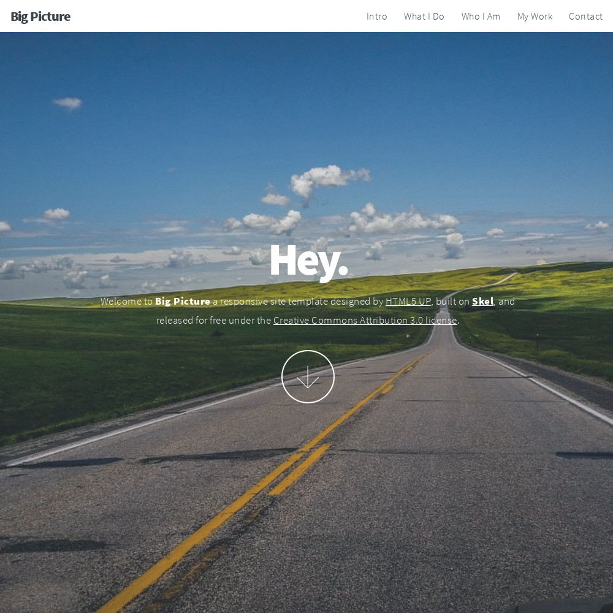
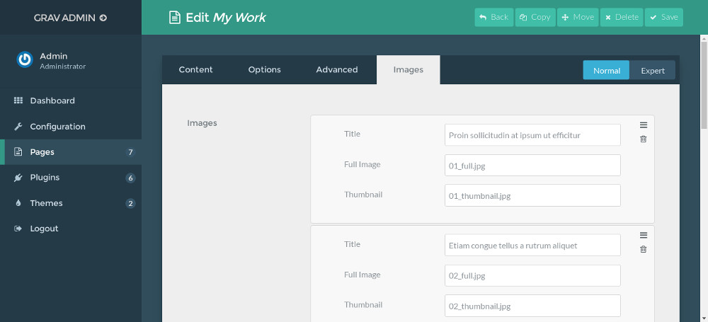
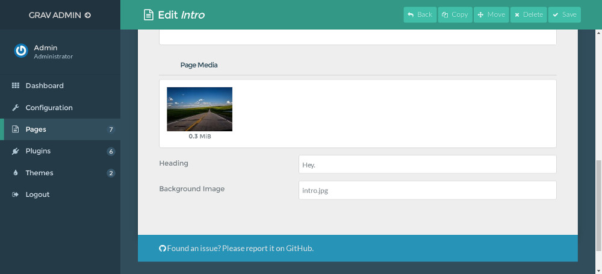
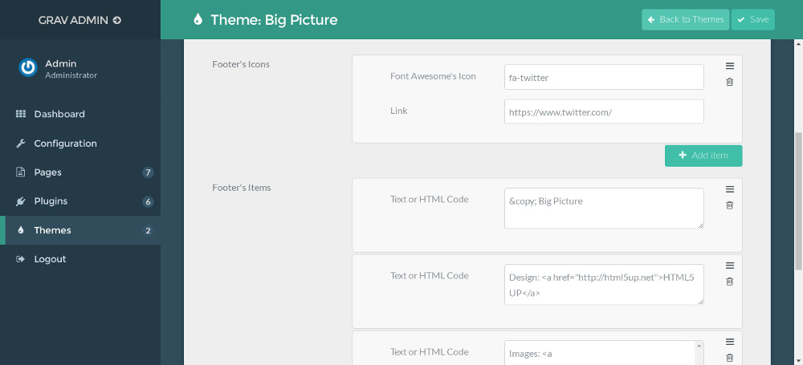

# Big Picture theme for Grav CMS



Big Picture theme is a port of [Big Picture](http://html5up.net/big-picture) by [HTML5 UP](http://html5up.net/).

## Demo

You can find a demo of the theme at [grav-theme-big-picture.flatfiledeveloper.com](https://grav-theme-big-picture.flatfiledeveloper.com).

## Features

* One page with contact form
* Fully responsive
* Built on HTML5/CSS3/[Skel](https://github.com/n33/skel)
* Font Awesome ready
* Released under [Creative Commons Attribution 3.0 License](http://html5up.net/license)

## Installation

### GPM Installation (Preferred)

The simplest way to install this theme is via the [Grav Package Manager (GPM)](http://learn.getgrav.org/advanced/grav-gpm) through your system's Terminal (also called the command line).  From the root of your Grav install type:

    bin/gpm install big-picture

This will install the Gateway theme into your `/user/themes` directory within Grav. Its files can be found under `/your/site/grav/user/themes/big-picture`.

### Manual Installation

To install this theme, just download the zip version of this repository and unzip it under `/your/site/grav/user/themes`. Then, rename the folder to `big-picture`.

You should now have all the theme files under

    /your/site/grav/user/themes/big-picture

>> NOTE: This theme is a modular component for Grav which requires the [Grav](http://github.com/getgrav/grav), [Error](https://github.com/getgrav/grav-theme-error), [Problems](https://github.com/getgrav/grav-plugin-problems), [Email](https://github.com/getgrav/grav-plugin-email) and [Form](https://github.com/getgrav/grav-plugin-form) plugins.

## Setup

If you want to set Big Picture as the default theme, you can do so by following these steps:

* Navigate to `/your/site/grav/user/config`.
* Open the **system.yaml** file.
* Change the `theme:` setting to `theme: big-picture`.
* Save your changes.
* Clear the Grav cache. The simplest way to do this is by going to the root Grav directory in Terminal and typing `bin/grav clear-cache`.

Once this is done, you should be able to see the new theme on the frontend. Keep in mind any customizations made to the previous theme will not be reflected as all of the theme and templating information is now being pulled from the **big-picture** folder.

## Configuration with Admin plugin

If you have [Admin plugin](https://github.com/getgrav/grav-plugin-admin) installed, you can fully manage the sub-pages via Admin plugin.

* For all of the sub-pages, there is a `Heading` option in `Content` tab which is used to define the heading of each page.
* `Background Image` option is available in `Content` tab for `intro` and `info` page file.



* There is an `Images` tab for `gallery` template, it is used to setup the image gallery.



* To manage the items in footer, you edit the theme's settings. Links with icons are on the left side of footer, on the right side are custom text.



* When you create a page with `default` template (file name is `default.md`), you can show a menu item linked to your home page at the top right corner of the page, you just need to enter the label of the menu item to `Home Menu Item` field at the bottom of `Content` tab.


## Navigation Buttons

To have navigation button for each section, the folder name of your home page must be `home`, in its modular.md file you need to setup the custom ordering of your modular pages. Here is an example:

```
title: Home
content:
    items: '@self.modular'
    order:
        by: default
        dir: asc
        custom:
            - _intro
            - _what-i-do
            - _who-i-am
            - _my-work
            - _contact
```

## Updating

### GPM Update (Preferred)

The simplest way to update this theme is via the [Grav Package Manager (GPM)](http://learn.getgrav.org/advanced/grav-gpm). You can do this with this by navigating to the root directory of your Grav install using your system's Terminal (also called command line) and typing the following:

    bin/gpm update big-picture

This command will check your Grav install to see if your Gateway theme is due for an update. If a newer release is found, you will be asked whether or not you wish to update. To continue, type `y` and hit enter. The theme will automatically update and clear Grav's cache.

### Manual Update

Manually updating Big Picture is pretty simple. Here is what you will need to do to get this done:

* Delete the `your/site/user/themes/big-picture` directory.
* Download the new version of the Big Picture theme from this repository.
* Unzip the zip file in `your/site/user/themes` and rename the resulting folder to `big-picture`.
* Clear the Grav cache. The simplest way to do this is by going to the root Grav directory in terminal and typing `bin/grav clear-cache`.

> Note: Any changes you have made to any of the files listed under this directory will also be removed and replaced by the new set. Any files located elsewhere (for example a YAML settings file placed in `user/config/themes`) will remain intact.
